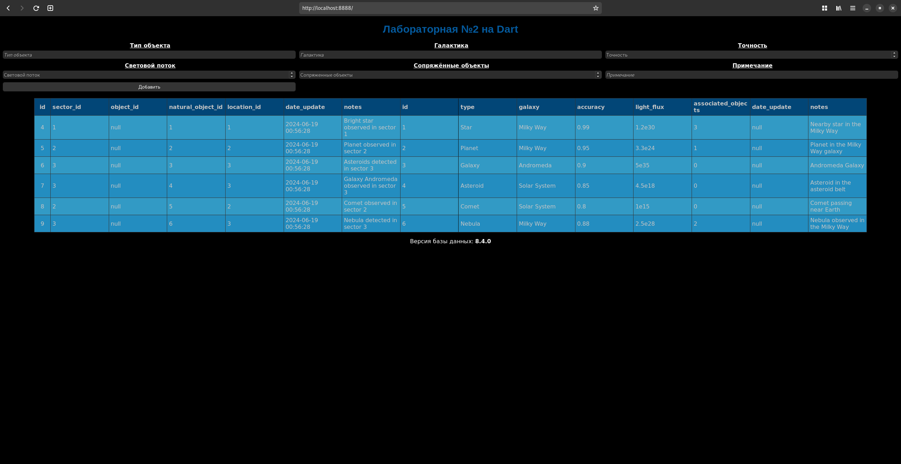

# db-pract-dart-1

Лабораторная работа по базам данных №1

## Демонстрация

Внешний вид главной страницы:

## Запуск

1) Установить и запустить Docker
2) Запустить `run.sh`  
или  
`docker compose build` + `docker compose up -d` любым удобным способом
3) Открыть [localhost:8888](http://localhost:8888)

## Остановка

1) `docker compose down`